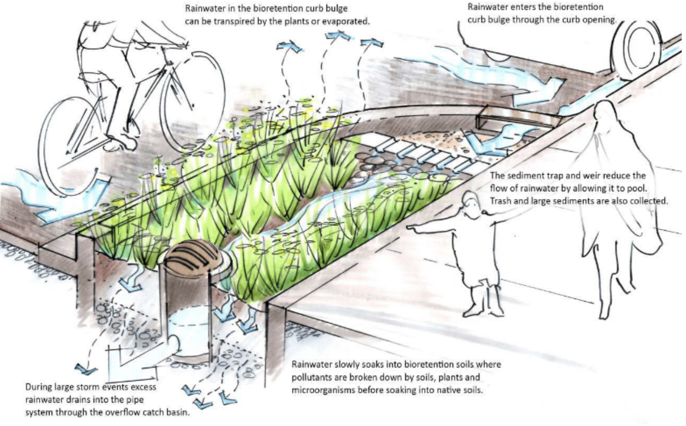

### Background
The stormwater infrastructure in many cities is facing challenges as the
climate changes, rainfall patterns change and sea levels rise. To meet these
challenges, cities are installing green infrastructure (GI) systems to absorb
and retain rainfall where it lands and reduce sewer overflow. Across North
America alone, cities are investing over $56.2 billion dollars in green
infrastructure. By doing so, communities are becoming more resilient against
climate change and are achieving environmental, social and economic benefits.
Novion’s Climate Intelligence Platform helps cities monitor their green
infrastructure for performance optimization, regulatory compliance, and
maintenance.

### Problem Statement
Once green infrastructure has been constructed, monitoring the changes in water
level after a rainfall event is required to verify its performance and net
impact.

Green Stormwater Infrastructure: A bioretention or bioswale (City of Vancouver,
2019)

Key parameters for understanding performance of green infrastructure include
drawdown time, drawdown rate, and well flood duration. Green infrastructure,
such as bioswales, include a monitoring well which consists of a perforated
pipe that extends along the vertical depth of the bioswale. After a rainfall
event, as the rainwater soaks into the bioswale, the water level in the
monitoring well rises. This water level can be studied to analyze performance
of the bioswale.



Water level datasets for two different types of green infrastructure are
available to download below:
  1. [Site
     A](https://drive.google.com/file/d/1n0o8VzmS85txUbXJzrUcCcCTP5goi6dB/view)
  2. [Site
     B](https://drive.google.com/file/d/1TNwAMm7QIQ8pyb72L2u6z1XVJEQiEWne/view)

The datasets above provide water level time series data which can be analyzed
to compute well flood duration, drawdown level, and drawdown duration for each
rainfall event. To identify individual rainfall events, consider each rainfall
event to have a minimum 6 hour antecedent dry period.

Develop algorithms to derive the following insights for each site:

  1. Identify each rainfall event. A significant rise in the water level
     preceded by a minimum 6 hours duration of no significant change in water
     level signals the start of a new rainfall event.
     * What is the average duration of a rainfall event?
  2. Compute the well flood duration (hours) for each rainfall event
     * What is the average well flood duration for each site?
     * List rainfall events where the well flood duration exceeds 72 hours
  3. Compute the drawdown level (mm) and drawdown duration (hours) for each
     rainfall event
     * What is the average drawdown level and average drawdown duration?
     * Compute the drawdown rate (mm/h) for each rainfall event as drawdown
       level divided by drawdown duration. List rainfall events where the
       drawdown rate is less than 40 mm/h.

##### Bonus
What other insights can be derived from the datasets that may help benchmark
performance of green infrastructure at one site vs another, or guide
development of new green infrastructure for better performance and utilization?

#### Appendix

  * **Drawdown Level**: The height from the peak water level to the bottom.
  * **Drawdown Duration**: The time it takes for the water level to go from its
    peak water level down to its baseline.
  * **Well Flood Duration**: The duration for the well to fill up to its peak
    water level and empty out.

#### References

1. City of Vancouver. (2019, November 5). Rain City Strategy. Rain City
Strategy - City of Vancouver. Retrieved from
https://vancouver.ca/files/cov/rain-city-strategy.pdf
1. City of Vancouver. (2022, April). Vancouver Green Infrastructure Performance
Monitoring Report. Green Infrastructure Performance Monitoring Report.
Retrieved from
https://vancouver.ca/files/cov/green-infrastructure-performance-monitoring-report.pdf
